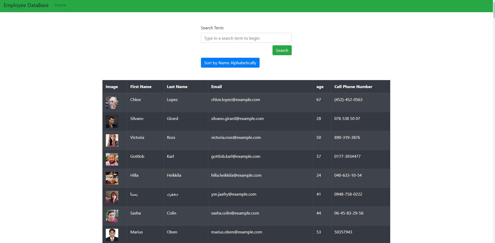
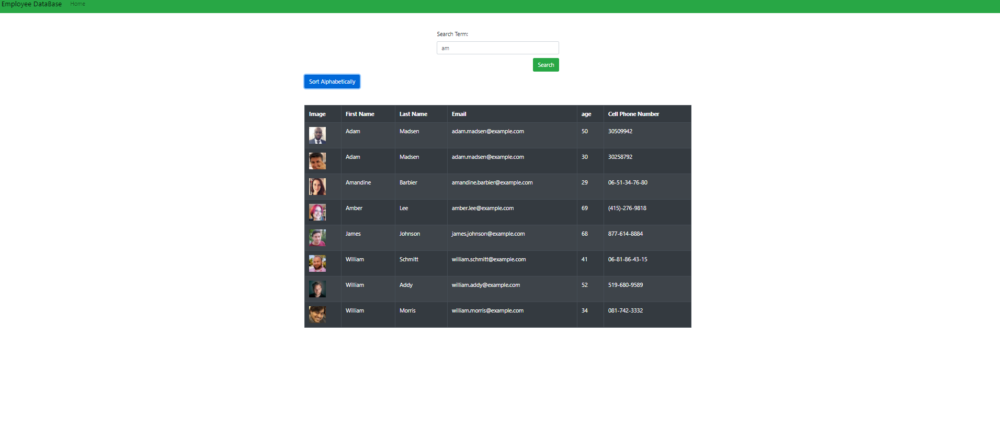

# 14-React-Employee

## Table of Contents

- [Description](#Description)
- [Installation](#Installation)
- [Usage](#Usage)
- [License](#License)
- [Contribution](#Contribution)
- [Tests](#Tests)
- [Questions](#Questions)

## Description

It is a web application that allows you to search for employees and sort them alphabetically with the push of a button.

## Screenshots

-home screen

-searching

-sorting

-searching and sorting

## Installation

you don't need to install anything you can use the site as is.

## Usage

you would go to the website and then type in the search bar to look up someone you search by name you can also click the sort button and it will sort the people alphabetically by their first name.

## License

## Contributing

You don't need to contrubute but if you want to you can email me.

## Tests

none

## Questions

- GitHub Username: [LoganPippin](github.com/LoganPippin)
- Email: logan.pippin32@gmail.com
